# Rapport de Lab – Rooting Android & Verified Boot / AVB

## Informations générales

* **Sujet du lab** : Rooting Android et analyse du mécanisme Verified Boot / AVB
* **Plateforme utilisée** : Android Emulator (Pixel 6 / Pixel 6 Pro)
* **Système hôte** : Windows 10
* **Outils utilisés** :

  * Android Studio
  * Android Emulator
  * ADB
  * Fastboot
  * PowerShell / CMD
* **Objectif** : Comprendre le fonctionnement du root Android, vérifier les mécanismes de sécurité Android Verified Boot (AVB) et analyser les risques liés au rooting.

---

# 1. Définition du Rooting

Le rooting Android consiste à obtenir des privilèges administrateur (root) sur un appareil Android. Cela permet d'accéder à toutes les parties du système, y compris celles normalement protégées. Le root donne un contrôle total sur le système d'exploitation Android. Cette technique est souvent utilisée pour les tests de sécurité, l'analyse mobile, la personnalisation avancée ou le bypass de certaines protections.

---

# 2. Schéma simple – Verified Boot / AVB

```text
Boot ROM
   ↓
Bootloader
   ↓ Vérification cryptographique
vbmeta
   ↓ Vérification intégrité
boot.img
   ↓
system.img
   ↓
Android démarre
```

## Explication

Android Verified Boot (AVB) vérifie l'intégrité du système pendant le démarrage.

* Chaque étape vérifie la suivante.
* Si un fichier système est modifié, Android peut bloquer le démarrage.
* AVB protège contre les modifications malveillantes du système.
* Le mode "enforcing" signifie que les vérifications sont actives.

---

# 3. Vérification de l'environnement Android

## Capture 1 – Vérification des appareils ADB

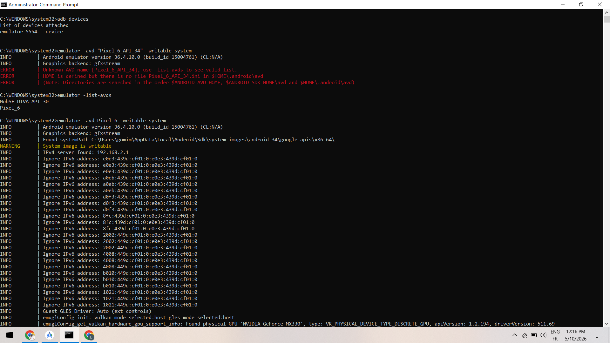

### Analyse

La commande `adb devices` confirme que l'émulateur Android est correctement détecté par ADB sous le nom `emulator-5554`.

Les commandes suivantes ont ensuite été utilisées :

```bash
adb shell getprop ro.boot.verifiedbootstate
adb shell getprop ro.boot.veritymode
```

Le résultat `enforcing` indique que le système Android applique activement les vérifications Verified Boot.

---

## Capture 2 – Vérification des privilèges root

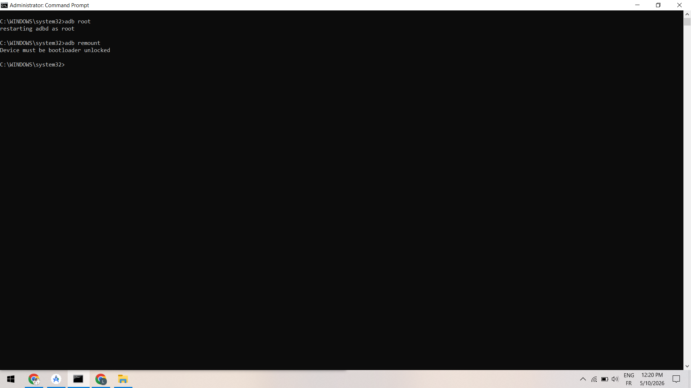

### Analyse

La commande suivante a été exécutée :

```bash
adb shell id
```

Résultat obtenu :

```text
uid=0(root) gid=0(root)
```

Cela confirme que l'environnement Android fonctionne avec des privilèges root.

Les propriétés Verified Boot ont également été vérifiées :

```bash
adb shell getprop ro.boot.verifiedbootstate
adb shell getprop ro.boot.veritymode
adb shell getprop ro.boot.vbmeta.device_state
```

Une tentative d'utilisation de :

```bash
adb shell "su -c id"
```

retourne une erreur car l'émulateur utilise déjà ADB en mode root.

---

## Capture 3 – Activation du mode root ADB

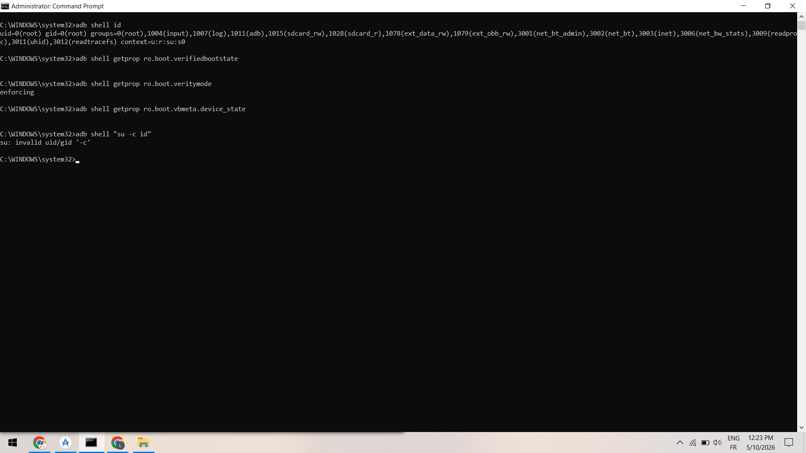

### Analyse

Les commandes suivantes ont été utilisées :

```bash
adb root
adb remount
```

`adb root` redémarre le service ADB avec les privilèges administrateur.

La commande `adb remount` échoue avec le message :

```text
Device must be bootloader unlocked
```

Cela montre que même avec le root, certaines protections AVB restent actives.

---

# 4. Analyse du Bootloader et Fastboot

## Capture 4 – Tentatives Fastboot

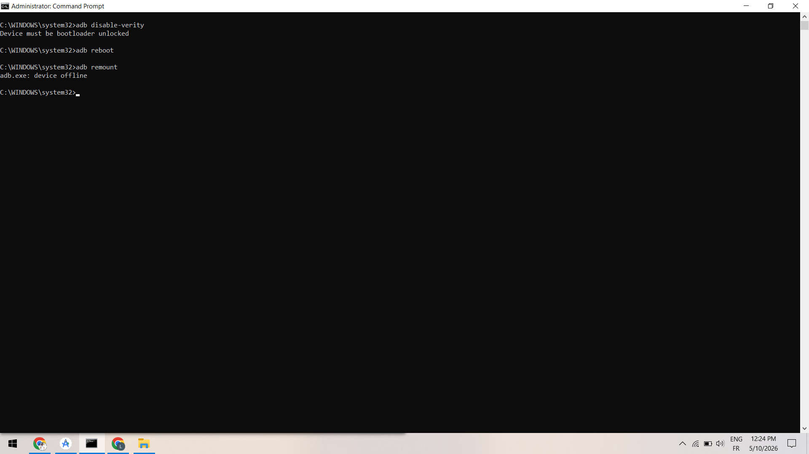

### Analyse

Plusieurs commandes Fastboot ont été testées :

```bash
fastboot oem device-info
fastboot getvar avb_boot_state
fastboot boot magisk_patched.img
```

Le message :

```text
waiting for any device
```

indique que l'émulateur n'était pas démarré en mode bootloader / fastboot.

---

## Capture 5 – Vérification AVB via Fastboot

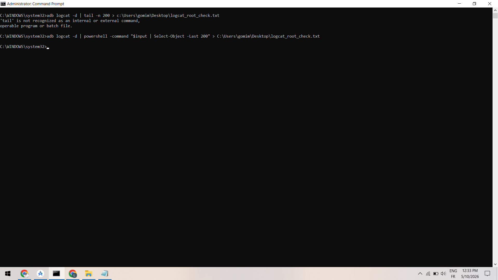

### Analyse

La commande suivante :

```bash
fastboot getvar avb_boot_state
```

reste bloquée sur :

```text
waiting for any device
```

car aucun appareil Fastboot n'était connecté.

---

# 5. Gestion et redémarrage des AVD

## Capture 6 – Création et démarrage d'AVD writable-system

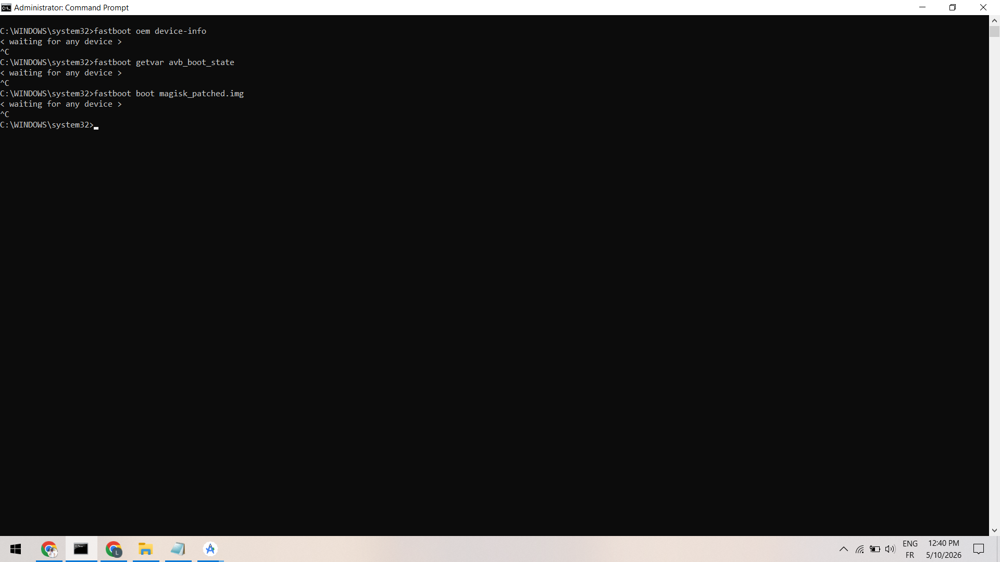

### Analyse

L'utilisateur tente d'abord de démarrer un AVD inexistant :

```bash
emulator -avd "Pixel_6_API_34" -writable-system
```

Le système retourne :

```text
Unknown AVD name
```

Ensuite, la commande suivante liste les AVD disponibles :

```bash
emulator -list-avds
```

Puis l'AVD correct est démarré :

```bash
emulator -avd Pixel_6 -writable-system
```

Le message :

```text
System image is writable
```

confirme que l'image système est montée en écriture.

---

## Capture 7 – Wipe data et redémarrage propre

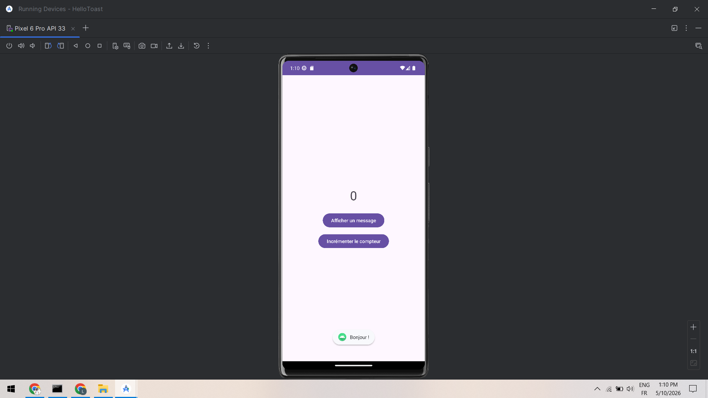

### Analyse

Les commandes suivantes sont utilisées :

```bash
adb emu avd stop
emulator -avd Pixel_6_Pro -wipe-data
```

Le `wipe-data` permet de remettre l'émulateur dans un état propre.

Cette étape est importante après des manipulations root ou système.

---

# 6. Tests fonctionnels Android

## Capture 8 – Application Android HelloToast

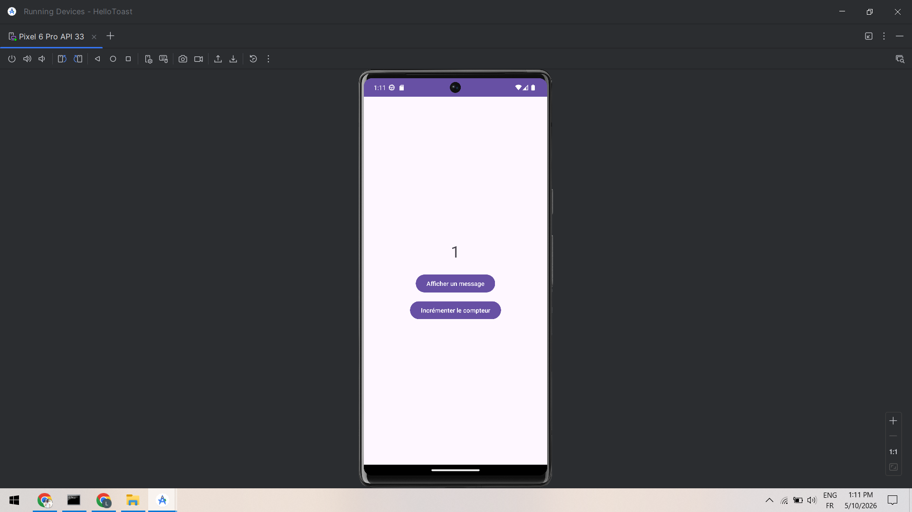

### Analyse

L'application Android fonctionne correctement.

Le bouton "Afficher un message" affiche un Toast Android avec le message :

```text
Bonjour !
```

Cela valide le bon fonctionnement de l'émulateur.

---

## Capture 9 – Test du compteur

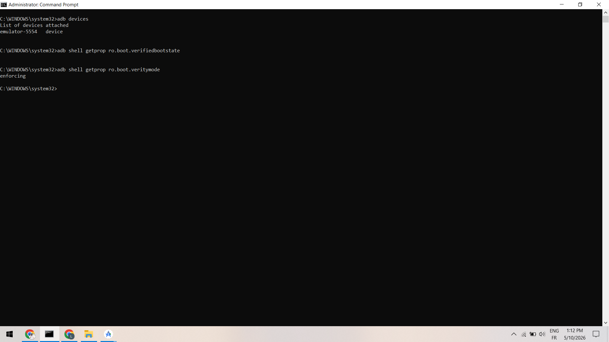

### Analyse

Le bouton :

```text
Incrémenter le compteur
```

modifie correctement la valeur affichée.

Le compteur passe de `0` à `1`, confirmant le bon fonctionnement de l'application.

---

# 7. Gestion des logs Android

## Capture 10 – Export des logs Android

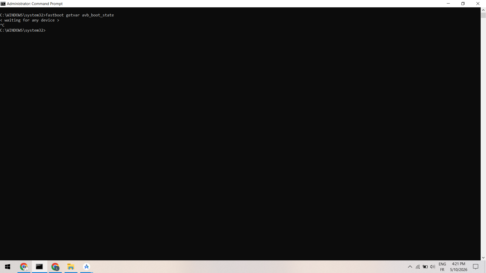

### Analyse

Une première tentative avec :

```bash
adb logcat -d | tail -n 200
```

échoue car la commande `tail` n'est pas disponible sous CMD Windows.

Une solution PowerShell est ensuite utilisée :

```bash
adb logcat -d | powershell -command "$input | Select-Object -Last 200" > C:\Users\gomim\Desktop\logcat_root_check.txt
```

Le fichier `logcat_root_check.txt` est alors généré avec succès.

---

## Capture 11 – Désactivation de verity

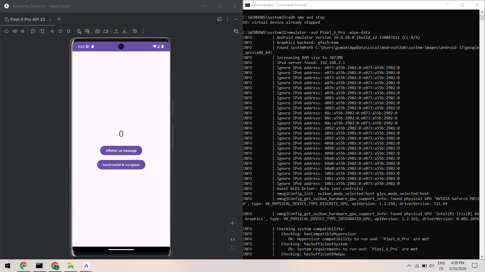

### Analyse

Les commandes suivantes sont exécutées :

```bash
adb disable-verity
adb reboot
adb remount
```

Le système retourne :

```text
Device must be bootloader unlocked
```

Cela démontre que la désactivation de dm-verity nécessite un bootloader déverrouillé.

Le message :

```text
device offline
```

apparaît temporairement après le reboot de l'émulateur.

---

# 8. Risques liés au Rooting

| Risque                          | Description                                      |
| ------------------------------- | ------------------------------------------------ |
| Perte de sécurité               | Les protections Android peuvent être contournées |
| Malware root                    | Les malwares obtiennent des privilèges élevés    |
| Vol de données                  | Accès total aux fichiers utilisateurs            |
| Désactivation AVB               | Le système devient plus vulnérable               |
| Instabilité système             | Crashs ou bootloops possibles                    |
| Applications bancaires bloquées | Détection du root par SafetyNet / Play Integrity |
| Modification système dangereuse | Suppression accidentelle de fichiers critiques   |
| Surface d'attaque augmentée     | Plus de possibilités d'exploitation              |

---

# 9. Mesures défensives

| Mesure défensive             | Objectif                              |
| ---------------------------- | ------------------------------------- |
| Android Verified Boot        | Vérifier l'intégrité du système       |
| dm-verity                    | Détecter les modifications système    |
| Bootloader verrouillé        | Empêcher le flash non autorisé        |
| SELinux enforcing            | Limiter les privilèges                |
| Play Integrity API           | Détecter les appareils rootés         |
| Chiffrement Android          | Protéger les données utilisateur      |
| Détection root dans les apps | Bloquer certaines fonctions sensibles |
| Mises à jour de sécurité     | Corriger les vulnérabilités           |

---

# 10. MASVS – Exigences résumées

## MASVS-RESILIENCE

L'application doit résister aux tentatives de bypass, hooking ou rooting.

## MASVS-PLATFORM

L'application doit utiliser correctement les mécanismes de sécurité Android.

---

# 11. MASTG – Idées de tests

| Test MASTG           | Objectif                           |
| -------------------- | ---------------------------------- |
| Vérification du root | Détecter si l'appareil est rooté   |
| Analyse AVB          | Vérifier l'intégrité Verified Boot |

---

# 12. Fiche environnement

| Élément        | Valeur                |
| -------------- | --------------------- |
| OS hôte        | Windows 10            |
| IDE            | Android Studio        |
| Émulateur      | Pixel 6 / Pixel 6 Pro |
| Android API    | API 33 / API 34       |
| Outils         | ADB, Fastboot         |
| Type d'analyse | Rooting & AVB         |

---

# 13. Checklist Reset

| Vérification       | Statut     |
| ------------------ | ---------- |
| adb devices        | ✔ Réalisé  |
| adb root           | ✔ Réalisé  |
| adb remount        | ✔ Testé    |
| adb disable-verity | ✔ Testé    |
| wipe-data          | ✔ Réalisé  |
| export logcat      | ✔ Réalisé  |
| vérification AVB   | ✔ Réalisée |
| redémarrage AVD    | ✔ Réalisé  |

---

# Conclusion

Ce lab a permis de comprendre le fonctionnement du root Android et des protections Android Verified Boot (AVB).

Les différentes commandes ADB et Fastboot ont permis d'observer :

* les privilèges root,
* les limites imposées par le bootloader,
* le rôle de dm-verity,
* le fonctionnement de Verified Boot,
* et les risques liés aux modifications système.

Les résultats montrent que même dans un environnement rooté, Android conserve plusieurs mécanismes de sécurité pour protéger l'intégrité du système.
